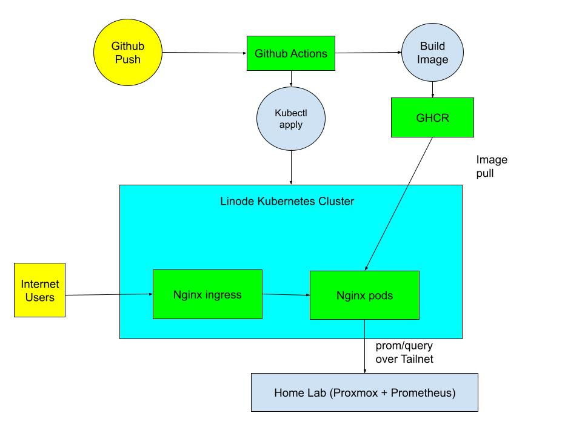

# seanslab.site — Sean's Lab

My personal portfolio site. It started as static pages on GitHub Pages, and I
rebuilt it into a containerized app running on a managed Kubernetes cluster with
an automated deploy pipeline and live metrics streamed from my home lab.

**Live:** https://seanslab.site

By rebuilding it into its current state, I learned more about deployment, containers, 
the CI/CD pipeline, and how modern web infrastructure is maintained. 

## Architecture



## Tech stack

| Layer          | Tools                                                    |
| -------------- | -------------------------------------------------------- |
| Frontend       | Static HTML/CSS/JS, Bootstrap, jQuery                    |
| Web server     | nginx (port 8080)                                        |
| Container      | Docker on GitHub Container Registry (GHCR)               |
| Orchestration  | Kubernetes on Linode (LKE) — 2 replicas, rolling updates |
| TLS / Ingress  | nginx ingress controller + cert-manager                  |
| CI/CD          | GitHub Actions                                           |
| IaC            | Terraform — LKE cluster + Firewall                       |
| Monitoring     | Prometheus + Grafana in home lab, proxied live to website|
| Networking     | Tailscale between cluster and home lab                   |

## Highlights

- **Zero-downtime deploys.** The Deployment uses `maxUnavailable: 0`, so a pod
  that doesn't pass its readiness probe stalls the rollout and fails the CI run
  while the old pods keep serving. A broken deploy won't make the site fail.
- **Live home-lab metrics.** The Home Lab page shows real Proxmox CPU, memory,
  and filesystem stats pulled from Prometheus. The browser never sees PromQL —
  nginx maps a fixed set of metric keys to queries and rejects anything else,
  keeping Prometheus reachable only over the tailnet.
- **Infrastructure as Code.** The LKE cluster is managed by Terraform, imported from the
  currently running cluster rather than rebuilt. A default-deny firewall is set up 
  on the nodes, allowing only internal cluster traffic while public access flows 
  through the NodeBalancer.

## Repository layout

```
├── index.html, 404.html, thank-you.html     Site pages
├── css/, js/, fonts/, images/, uploads/     Frontend 
├── files/                                   Resume
├── projects/                                Projects
│   ├── personal-website/
│   ├── home-lab-server/
│   └── cisco-labs-practice/
├── Dockerfile                               nginx image build
├── nginx.conf                               Server config + Prometheus proxy
├── terraform/                               Infrastructure as code
│   ├── provider.tf                          Provider + versions
│   ├── main.tf                              LKE cluster
│   ├── variables.tf
│   └── firewall.tf                          
├── k8s/                                     Deployment manifests
│   ├── 01-deployment.yaml
│   ├── 02-service.yaml
│   ├── 03-clusterissuer.yaml
│   ├── 04-ingress.yaml
│   └── ...
└── .github/workflows/deploy.yml             CI/CD pipeline
```

## Deployment

Every push to main triggers `.github/workflows/deploy.yml`, which builds the
image, pushes it to GHCR, applies the manifests to LKE, and waits for the rollout 
to succeed before the run passes. 

## Projects featured on the site

- **Personal Website** — this repo: static-to-Kubernetes migration.
- **Home Lab Server** — Proxmox virtualization, Windows Server AD/DHCP,
  Prometheus/Grafana monitoring, Ansible automation.
- **Cisco Modeling Labs** — network automation practice beyond Packet Tracer.
